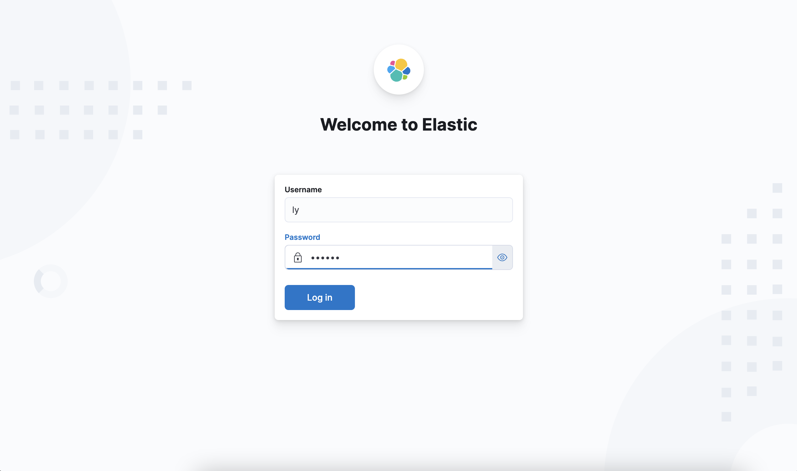
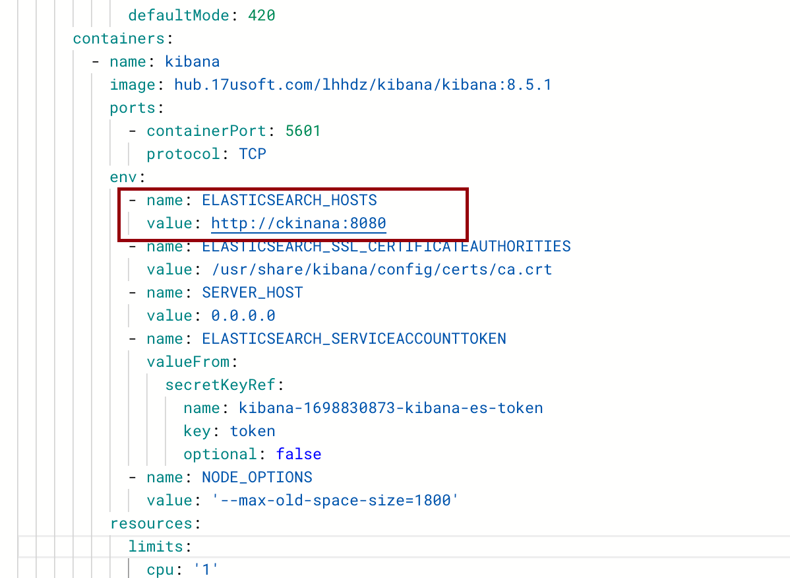
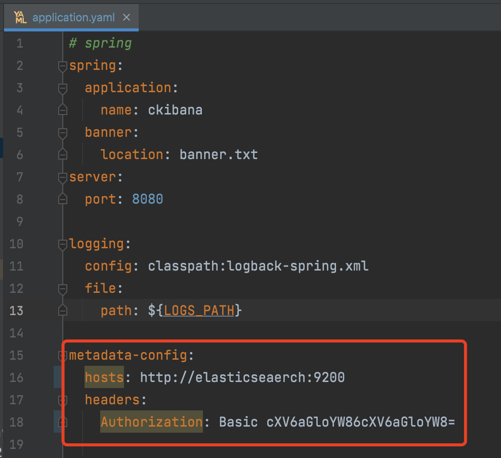
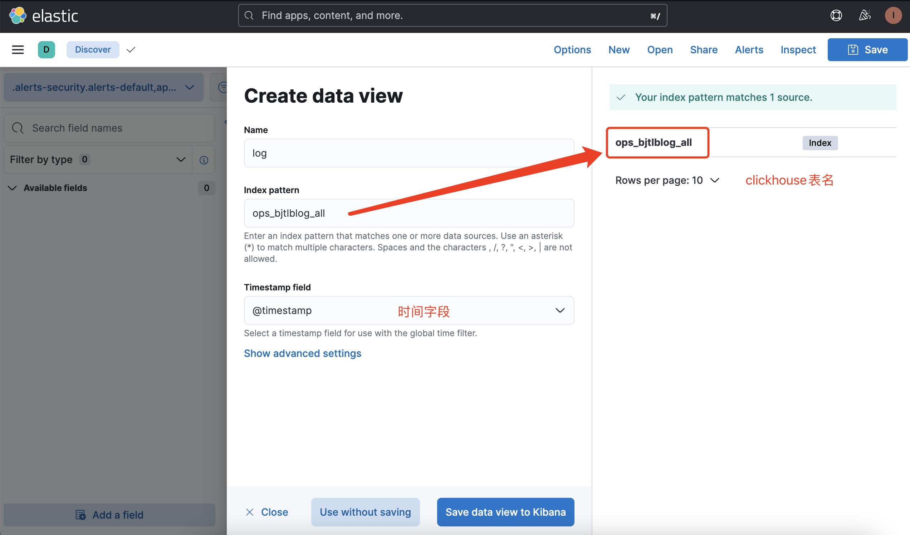
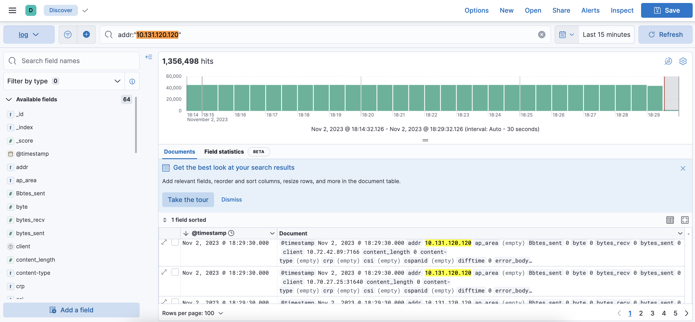
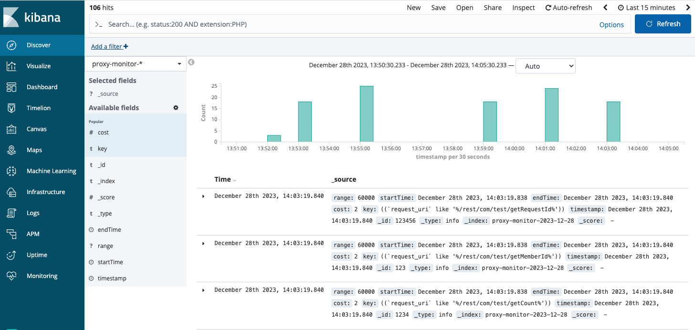
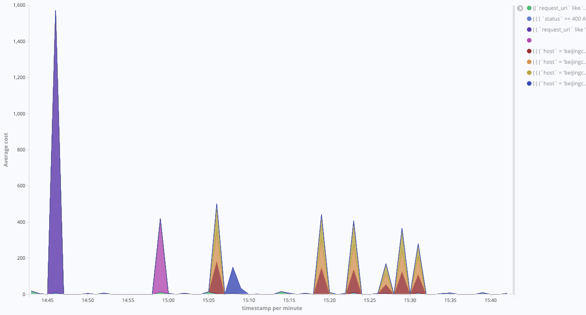
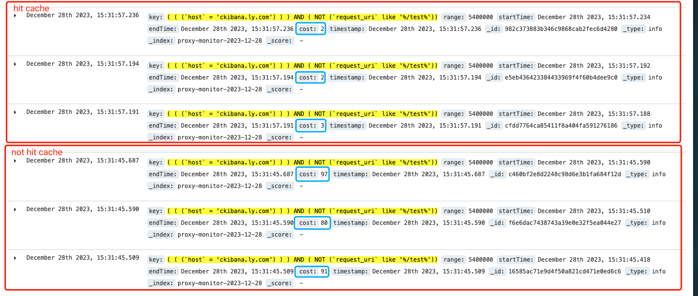

# usercase

## 1、访问原生kibana


## 2、变更kibana配置，连ckibana


## 3、ckibana启动配置


## 4、配置ckibana中的ck连接信息
```
curl --location --request POST 'localhost:8080/config/updateCk?url=ckUrl&user=default&pass=default&defaultCkDatabase=ops'
```

## 5、配置index pattern


## 6、进行查询


## 7、开启采样
当数据量比较大的时候，开启采样可以有效的提升查询性能，注: 采样阈值设置的低了，还原后的趋势图跟真实图会有差异。

## 8、开启查询监控
可以监控现在用了哪些语法在查询，配合黑名单功能，可以有效缓解使用不当造成的clickhouse资源过高的问题。


利用监控指标，可以做一些图表，增加可观测性。

例如，每种查询的耗时情况：


## 9、设置round时间
可以对时间进行round取值，这样可以很好的配合查询缓存来提升性能。

常见case，kibana里面一群用户在查询相同一个问题，此时查询条件高度一致，配置round可以很好的缓解ClickHouse的压力。

## 10、开启查询缓存
当查询语句跟查询时间都一致时，后面的查询可以很好的命中es的缓存，缓解clickhouse的压力。
```
query.useCache: true
```

可见命中cache耗时仅有2ms，没命中的情况下在80毫秒。此配置默认关闭，我们也建议开启此配置。
利用ES底层作为存储媒介，当然存储成本也会相应的增高，需要您去维护proxy-cache索引的生命周期定期清理冷数据。

