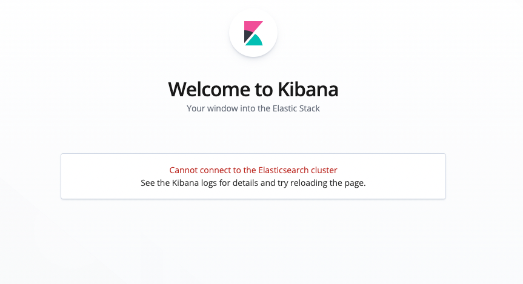
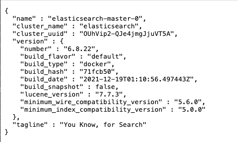
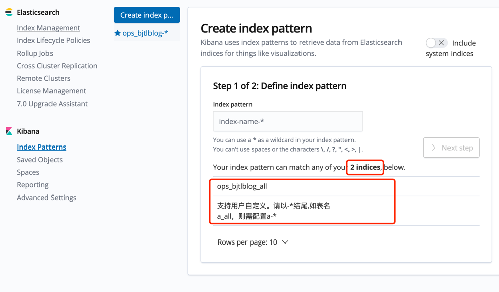
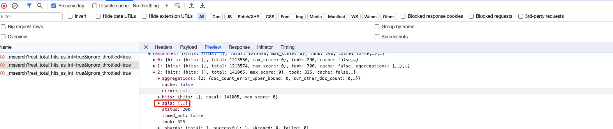

# troubleshooting

## 1、CKibana启动成功且没报错，但是访问kibana出现如下错误

报此错误大概率是初始化的配置不正常

**1）检查配置的元数据集群是否正确**

**2）检查kibana配置的elasticsearchHosts参数，代理地址是否正确，能否访问出现如下信息，有如下信息才表示代理配置正常**

## 2、创建不了index pattern

如图，红框处在创建index pattern的时候，如果没有选项可以创建index pattern，正常indices数量是大于0的

### 排查步骤如下

**1）首先确定输入的index pattern跟ck表是否一致，index pattern跟跟ck表名是精确匹配**

**2）检查ck配置是否正常**

**3）使用日志中输出的sql，在ck中是否能查询到对应表**

## 3、创建index pattern时候，选不了时间字段
匹配时间字段的逻辑是：

**1）字段为Date类型，比如DateTime64类型，会被认为是时间类型**

**2）或者字段名中包含time，比如（`@timestamp` UInt64），会被认为是时间类型**

这两种情况下满足任意一个，字段都会被认为是时间字段，如果选择不了时间字段，需要检查下ck表中字段是否符合匹配逻辑

## 4、查不出来数据
打开f12,可以看到响应的里面有sql,可以看到具体的执行sql

## 5、ClickHouse cpu占用过高
可以基于ClickHouse的`system.query_log` 来做具体分析,重点关注`read_rows`跟`read_bytes`2个指标
处理方案包括:

**1）找到对应sql加入CKibana黑名单

**2）调整对应的图表
